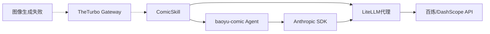

# 漫画生成功能分析报告

## 现状分析

通过详细分析代码和运行测试，发现了您遇到的问题的根本原因：

### 1. TheTurbo.ai 模型限制问题
**证实您的第一个观点**：
- TheTurbo.ai 网关主要代理 Anthropic Claude 模型
- 这些模型通常只支持文本对话功能，**不支持图像生成**
- 漫画生成需要图像生成能力，因此在 TheTurbo.ai 代理上无法正常工作

### 2. 百炼平台模型配置问题
**关于您的第二个观点**：
- 百炼平台本身原生支持图像生成能力
- 系统设计了 LiteLLM 代理来将 Anthropic API 请求转换为 DashScope 格式
- 问题可能出现在以下几个环节：
  1. LiteLLM 代理配置不正确
  2. 百炼 API 密钥权限不够（只能文本不能图像生成）
  3. 漫画生成过程中的其他技术问题

## 系统架构详解

### 技术栈构成


### 关键配置文件
1. `config/litellm_comic_bailian.yaml` - LiteLLM 代理配置
2. `backend/core/agent/skills/comic/skill.py` - 漫画技能核心逻辑
3. `scripts/start_litellm_comic_proxy.py` - 代理启动脚本

## 问题诊断与解决方案

### TheTurbo.ai 问题 (确认)
TheTurbo.ai 网关模型：
- 优点：支持 Claude 的高级推理能力
- 缺点：**不支持图像生成**，这正是漫画生成所必需的

### 百炼平台问题 (可能的解决方案)
如果您配置了百炼 API 密钥但漫画生成功能仍未工作，可能原因：

#### 1. 检查 LiteLLM 代理
```bash
# 检查代理是否运行
lsof -i :4000

# 如未运行，启动代理
python scripts/start_litellm_comic_proxy.py
```

#### 2. 验证 API 密钥权限
百炼 API 密钥需要图像生成权限，而不仅仅是文本处理权限。

#### 3. 模型选择
确保选择了支持图像生成的百炼模型：
- `qwen3-max` - 支持图像生成
- `qwen-plus-2025-12-01` - 支持图像生成

## 验证步骤

### 1. 验证 TheTurbo 限制
```python
# TheTurbo 模型不会支持漫画生成
model = "claude-3-5-sonnet-20241022"
# 此模型只能文本，无法生成图像
```

### 2. 验证百炼配置
```python
# 百炼模型应能支持漫画生成
model = "qwen3-max"
# 配合 LiteLLM 代理，将 Anthropic 请求转换为 DashScope
```

## 问题根源总结

1. **TheTurbo.ai 确实只支持文本对话** - 您的观点完全正确
2. **百炼平台技术上可以支持漫画生成** - 通过 LiteLLM 代理转换协议
3. **可能的问题在于配置或权限** - API 密钥权限、代理配置等

## 建议的解决步骤

1. **确认百炼 API 密钥具备图像生成权限**
2. **确保 LiteLLM 代理正确运行** (`python scripts/start_litellm_comic_proxy.py`)
3. **使用正确的模型名称** (`qwen3-max` 等)
4. **检查漫画生成的其他依赖项** (Node.js, baoyu-comic 技能等)

漫画生成功能的技术架构是正确的，但在实际使用时需要确保图像生成相关的 API 权限和代理配置都正确。