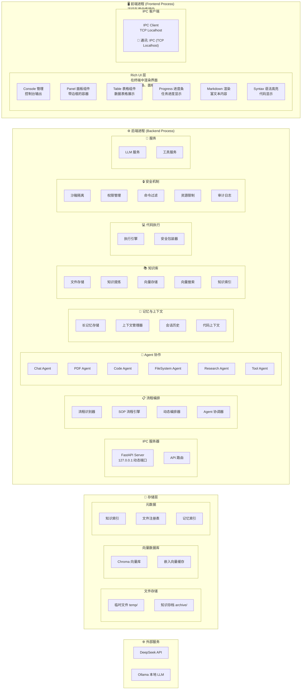

# 系统架构图

本文档使用 Mermaid 图表展示系统的整体架构。

## 整体架构图

## 通讯关系说明

### 进程间通讯
- **前端 ↔ 后端**：IPC (TCP Localhost)
  - 前端 IPC Client 通过 TCP 连接到后端 FastAPI Server
  - 使用动态端口，通过端口文件共享

### 后端内部通讯

#### 流程编排层
- **IPC 服务器 → 流程编排层**：路由请求
- **流程识别器 → SOP 流程引擎/动态编排器**：选择执行模式
- **编排器 → Agent 协调器**：任务分解和分配

#### Agent 协作
- **Agent 协调器 → 多个 Agent**：协调执行
- **Agent → 长记忆系统**：存储和检索记忆
- **Agent → 知识库管理**：知识检索和存储
- **Agent → 代码执行层**：执行代码
- **Agent → 服务层**：调用 LLM 和工具

#### 代码执行
- **代码执行层 → 安全执行层**：安全检查
- **安全执行层 → 沙箱**：隔离执行

#### 知识库
- **知识库管理 → 存储层**：存储文件、向量、元数据
- **向量搜索 → 向量数据库**：检索向量

#### 服务调用
- **LLM 服务 → 外部服务**：调用 DeepSeek API 或 Ollama

#### 记忆存储
- **长记忆系统 → 存储层**：存储记忆索引和上下文

## 模块说明

### 前端进程 (Frontend Process)
前端进程运行在用户终端中，包含两个主要部分：

- **Rich UI 层**：
  - 使用 Rich 库在终端中渲染富文本界面
  - **Panel（面板）**：带边框的容器，用于显示内容块、消息、结果等
  - **Table（表格）**：数据表格展示，支持多列、样式、排序等
  - **Progress（进度条）**：显示任务进度和状态
  - **Markdown 渲染**：支持 Markdown 格式的富文本内容
  - **Syntax（语法高亮）**：代码语法高亮显示
  - **Console 管理**：统一的控制台输出管理
  - 负责用户交互和界面展示，直接输出到用户终端

- **IPC 客户端**：
  - 通过 TCP Localhost 与后端进程通信
  - 发送用户请求，接收后端响应
  - 处理前后端之间的数据交换

### 后端进程 (Backend Process)

#### IPC 服务器层
- FastAPI 服务器，监听 127.0.0.1
- 动态分配端口，通过端口文件共享

#### 流程编排层
- **流程识别器**：识别任务类型，选择 SOP 或动态编排
- **SOP 流程引擎**：执行标准操作流程
- **动态编排器**：LLM 动态分析和任务分解
- **Agent 协调器**：协调多个 Agent 的执行

#### 多 Agent 协作层
- 多个专门化的 Agent，各自负责特定领域

#### 长记忆和上下文管理
- 存储长期记忆和会话上下文
- 管理代码上下文缓存

#### 知识库管理层
- 文件存储、知识提炼、向量化、搜索

#### 代码执行层
- 代码执行引擎和安全执行包装器

#### 安全执行层
- 沙箱隔离、权限控制、命令过滤、资源限制、审计日志

#### 服务层
- LLM 服务和工具服务

### 存储层
- 文件存储、向量数据库、元数据存储

### 外部服务
- DeepSeek API 和本地 Ollama

## 数据流说明

1. **用户请求流程**：
   - 用户在终端中输入 → 前端 Rich UI 接收 → IPC 客户端发送 → 后端 IPC 服务器

2. **任务处理流程**：
   - IPC 服务器 → 流程识别器 → SOP 流程引擎 或 动态编排器
   - 编排器 → Agent 协调器 → 多个专门化 Agent

3. **知识检索流程**：
   - Agent → 知识库管理 → 向量搜索 → 向量数据库

4. **代码执行流程**：
   - Agent → 代码执行层 → 安全执行层 → 沙箱执行

5. **记忆存储流程**：
   - Agent → 长记忆系统 → 存储层

6. **LLM 调用流程**：
   - Agent → LLM 服务 → 外部服务（DeepSeek/Ollama）

