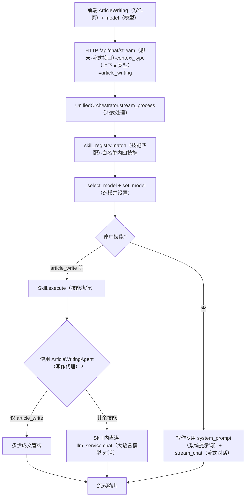
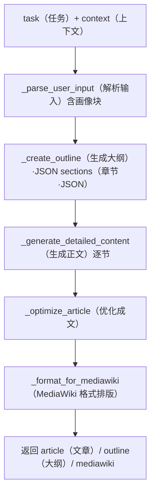
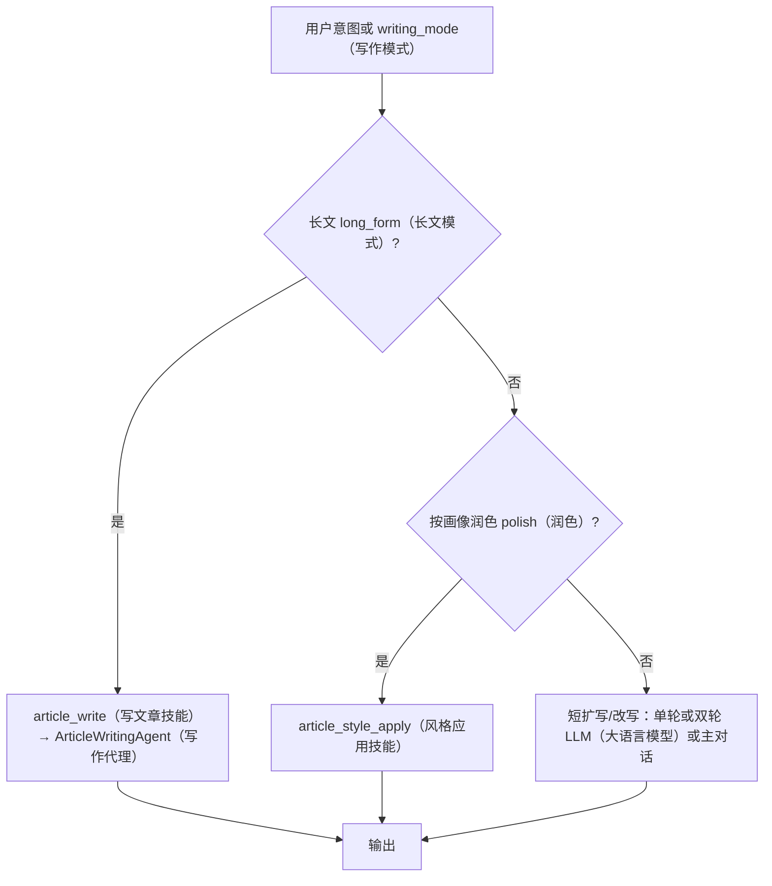
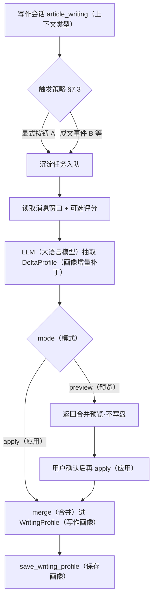

# 写作助手：Agent、大模型与可配置性设计

**文档类型**：01X 系统组件 / 配置与路由  
**状态**：现状说明；§6.1 执行顺序修复 **已于 2026-03-21 落地**；其余为可选提案  
**时间**：2026-03-21；**2026-03-23 增补**：§2.3、§7；**2026-03-24**：§2.5 / §7.2.1 **Mermaid 流程图**  
**范围**：前端「写作助手」页（`context_type=article_writing`）所触发的编排、技能、Agent 与 LLM 调用链；**不含**通用对话、工作助手。

---

## 1. 目标与术语

| 术语 | 含义 |
|------|------|
| **写作助手** | React `ArticleWriting.jsx`，请求中带 `context_type: article_writing`。 |
| **Orchestrator** | `backend/core/agent/orchestrator.py` 中的编排器：选技能、调 LLM、流式输出；**不是**一个独立注册的 Agent 类，但承担「路由 + 模型切换」。 |
| **写作类技能** | 仅在 `article_writing` 白名单内匹配的技能（见 §2）。 |
| **ArticleWritingAgent** | `ArticleWritingAgent`（继承 `BlogWritingAgent`），在**部分技能**内部用于多步写文章（大纲/正文 JSON 等）。 |

---

## 2. 写作助手用到的 Agent / 技能 / 直接 LLM

### 2.1 工具（Tools）

`article_writing` 在 `agent_tools_registry.py` 中 **不配备任何工具**（`AGENT_TOOLS["article_writing"] = []`）。写作助手对话路径 **不向 LLM 传入 function calling 工具列表**（与通用对话不同）。

### 2.2 技能白名单（Skills）

配置位置：`backend/core/agent/agent_tools_registry.py` → `AGENT_SKILLS["article_writing"]`：

| 技能名 | 说明 | 内部实现要点 |
|--------|------|----------------|
| `article_outline` | 生成文章大纲 | 技能内直接使用 `context["llm_service"].chat(...)`，**不**经过 `ArticleWritingAgent`。 |
| `article_write` | 撰写正文 | 通过 `get_article_writing_agent(...)` 使用 **`ArticleWritingAgent`**（继承 `BlogWritingAgent`），内部多步调用同一 `llm_service`。 |
| `article_style_apply` | 按画像润色 | 技能内 **`llm_service.chat`** + `get_profile_block_for_prompt()`，**不**经过 `ArticleWritingAgent`（详见 §2.3）。 |
| `writing_profile_summary` | 从用户粘贴的文章总结写作画像 | 技能内 **`LLMService.chat`** + 写回画像存储，**不**使用 `ArticleWritingAgent`。 |

### 2.3 技能 → LLM / Agent 对照表（以代码为准，防误传）

以下表格用于避免常见误解（例如误认为 **`article_style_apply` 走 `ArticleWritingAgent`**）。**写作助手白名单**内 **仅 `article_write` 使用 `ArticleWritingAgent`**；其余写作向技能均为 **Skill 内直连 `llm_service`**。  
**不存在**名为「写作画像 Agent」的独立类：画像结构体与读写见 **`backend/core/agent/writing_profile.py`**，总结见技能 **`writing_profile_summary`**。

| 技能名 | 在 `AGENT_SKILLS["article_writing"]` | 实现方式概要 | 使用 `ArticleWritingAgent`？ | 主要代码路径 |
|--------|--------------------------------------|----------------|------------------------------|--------------|
| `article_outline` | ✅ | `llm_service.chat` + 注入 `get_profile_block_for_prompt()` | **否** | `backend/core/agent/skills/article_outline/skill.py` |
| `article_write` | ✅ | `get_article_writing_agent(...).execute(...)`，多步成文 | **是** | `backend/core/agent/skills/article_write/skill.py`、`backend/core/agent/agents/article_writing_agent.py` |
| `article_style_apply` | ✅ | `llm_service.chat` + `get_profile_block_for_prompt()`，单轮润色 | **否** | `backend/core/agent/skills/article_style_apply/skill.py` |
| `writing_profile_summary` | ✅ | `llm_service.chat` + `save_writing_profile` 等 | **否** | `backend/core/agent/skills/writing_profile_summary/skill.py` |
| `blog_writing` | ❌（不在写作助手白名单；`general_chat` 等未配置时为「全部技能」） | `get_article_writing_agent` | **是** | `backend/core/agent/skills/blog_writing/skill.py` |

**维护约定**：若某技能改为委托 `ArticleWritingAgent` 或改为纯 LLM，须 **同步更新本表与 §2.2**。

### 2.4 与「写作画像」相关、但不在写作助手对话里的调用

| 能力 | 入口 | LLM 使用方式 |
|------|------|----------------|
| **根据高分章节更新画像** | `POST /api/settings/writing-profile/learn-from-ratings` | `writing_profile_routes.py` 内 **`LLMService()` 默认实例**，与 Orchestrator 当前 `model` **无联动**。 |

### 2.5 流程图（Mermaid）

#### 2.5.1 写作助手一次流式请求（与 `stream_process` 对齐）



#### 2.5.2 `ArticleWritingAgent` 内部管线（长文默认）

用户**未**手写大纲时，由 **`_create_outline`** 用 LLM **现生成** 带 `sections` 的结构，再逐节撰写。



#### 2.5.3 写作意图分流（提案：`writing_mode` / 显式 UI）

**当前**：`article_write` **一律**走 §2.5.2 全管线。以下为目标态，避免「两段话」也强行多节大纲。



---

## 3. 大模型实际从哪里来？

### 3.1 共享的 `LLMService` 实例

`Orchestrator` 构造时创建 **`self.llm_service = LLMService()`**（默认 `LLM_PROVIDER` + 各提供商的 `*_MODEL` 环境变量，见 `llm_service.py`）。  
技能执行时 `context["llm_service"]` **即该实例**。

### 3.2 写作助手主对话（流式 `/api/chat/stream`）

1. 前端 `ArticleWriting` 通过 **`ModelSelector`** 选择模型，请求体带 **`model`**。  
2. `chat_routes` 将 `model` 放入 `context["model"]`。  
3. 在 **`stream_process` 中**，若未命中技能，则在调用 `stream_chat` **之前**执行 `_select_model`：  
   - 若 `context["model"]` 有值，优先解析为用户指定模型（含 `chat` / `code` / `reasoning` 别名）；  
   - 否则走智能选择（复杂度、`CHAT_MODEL` / `CODE_MODEL` / `REASONING_MODEL` 等）。  
4. **`self.llm_service.set_model(selected_model)`** 后，流式对话使用该模型。

**结论**：主对话使用的模型 = **用户所选** 或 **智能选择结果**，对应环境变量中的 **`CHAT_MODEL` / `CODE_MODEL` / `REASONING_MODEL`**（经 `ModelConfigManager` 解析）。

### 3.3 技能路径（含「总结画像」）— 执行顺序（已修复）

**历史问题**：在旧实现中，技能在 **`_select_model` + `set_model` 之前**执行，技能内看到的是 **`LLMService` 构造默认模型**，与页选模型不一致。

**当前行为（2026-03-21）**：在 `UnifiedOrchestrator.stream_process` 中，于 **`skill_registry.match` 之后、`matched_skill.execute` 之前** 调用 **`_select_model` + `set_model`**；未命中技能的主路径 **不再第二次**调用 `_select_model`。技能分支正常结束前 **`reset_model()`**，与主路径一致。同步地，`process()` 在技能前统一 `_select_model`，技能成功返回前 `reset_model()`；`_intelligent_orchestration` 内不再重复 `_select_model`（由 `process()` 入口保证已选模）。

`learn-from-ratings`（`writing_profile_routes`）仍为独立 `LLMService()`，与对话所选模型无联动（见 §4）。

### 3.4 默认线路与环境变量（全局）

| 变量 | 作用 |
|------|------|
| `LLM_PROVIDER` | `deepseek` / `bailian` / `theturbogateway`（默认 deepseek） |
| `DEEPSEEK_MODEL` / `BAILIAN_MODEL` / `TURBOGATEWAY_MODEL` | 未显式传 `model` 构造 `LLMService` 时的默认模型 id |
| `CHAT_MODEL` / `CODE_MODEL` / `REASONING_MODEL` | `_select_model` 与别名 `chat`/`code`/`reasoning` 解析用 |

API Key、Base URL 由 `model_config.py` 中提供商表映射（如 `DEEPSEEK_API_KEY`）。

---

## 4. 是否可配置？今天怎么配？

| 能力 | 今天能否配 | 怎么配 |
|------|------------|--------|
| 写作助手 **主对话** 模型 | ✅ | 页内模型选择器 → `context.model`；或依赖服务端智能选择 + `CHAT_MODEL` 等。 |
| **技能**（含总结画像）在流式中的模型 | ✅ 与主对话一致 | 流式：`stream_process` 在 execute 前 **`_select_model`**（含 `context["model"]`）。仍受全局 `LLM_PROVIDER` / Key 约束。 |
| **learn-from-ratings** | ⚠️ 仅全局默认 | `LLMService()` 新实例，同全局 `LLM_PROVIDER` + `*_MODEL`。 |

**流式「总结画像」**已与页选模型对齐（§3.3、§6.1）。**若要让「根据高分章节更新画像」与某指定模型一致**：须改 `learn-from-ratings` 路由（共用 Orchestrator 或显式 `set_model` / 环境变量），见 §6.2 提案。

---

## 5. 配置页面放哪里更合适？（提案）

### 5.1 原则

- **模型与密钥**：偏「基础设施」，宜集中在 **设置 → 模型/服务商** 一类入口，与现有 **模型配置审计**（`SettingsModelConfigAudit`）心智一致。  
- **写作业务偏好**（画像、范文）：已在 **设置 → 写作画像**，不宜把大量 API 密钥塞进去。  
- **写作助手专属默认模型**：介于两者之间，建议 **单独小节** 可折叠，避免与「全站 CHAT_MODEL」混淆。

### 5.2 推荐信息架构

1. **首选（推荐）**  
   - 在 **设置** 下增加或扩展 **「模型与 API」** 页（若已有则追加区块）：  
     - **全局**：`CHAT_MODEL` / `CODE_MODEL` / `REASONING_MODEL`、智能选择开关（与现有后端 env 对齐的可视化或说明）。  
     - **写作助手**：  
       - 「对话默认模型」：与当前页内选择器关系写清楚（是否覆盖、是否仅默认）。  
       - 「技能专用模型（可选）」：`writing_profile_summary` / `article_outline` / `article_write` 共用或分项（见 §6 实现选项）。  

2. **次选（轻量）**  
   - 在 **写作画像** 页增加 Tab **「模型」**：仅配置与写作相关的 LLM（总结画像、learn-from-ratings）。  
   - 缺点：用户找「API Key」仍要去别处，容易分裂。

3. **不推荐**  
   - 仅放在 `ArticleWriting` 主界面深处：高级用户难以发现，且与全局 Key 重复配置易冲突。

### 5.3 与现有路由的对应关系（前端）

- 写作画像：`/settings/writing-profile`  
- 模型审计：`/settings/model-config-audit`（名称以 `App.jsx` 为准）  
- 提案新增区块可挂在 **模型审计同组侧边栏**，或 **写作画像子 Tab**，二选一为主、另一处放简短链接跳转。

---

## 6. 实现可配置时的后端方向（提案）

1. **执行顺序修复（高优先级）** — **已完成**  
   - 实现位置：`backend/core/agent/orchestrator.py` 的 `stream_process`（match 之后、技能 execute 之前）、`process()`（同上）；回归：`backend/core/agent/tests/test_orchestrator_stream_skill_model.py`。

2. **可选：写作专用模型环境变量**  
   - 例如 `ARTICLE_WRITING_SKILL_MODEL`：仅当设置时，技能路径强制 `set_model` 到该值；否则回退到用户所选 / `CHAT_MODEL`。  
   - `learn-from-ratings` 可读取同一变量，避免与对话完全脱节。

3. **持久化**  
   - 若做 UI 配置页，需 **后端存储**（如扩展 `settings` API 或复用现有 model 配置存储），启动时或请求时同步到 `LLMService`；**不得**仅前端 localStorage 决定计费模型（除非明确为「仅本机覆盖」产品）。

---

## 7. 写作会话闭环：成文后从对话沉淀「喜好 / 经验」到画像（提案）

### 7.1 概念澄清：存到哪里？

- **不要**把用户数据写回 **Skill 类或技能代码**；Skill 是无状态的可执行单元。  
- **应**写入 **写作画像持久化**（当前为 `config/writing_profile.json`，经 `writing_profile.py` 的 `WritingProfile` / `save_writing_profile`），必要时扩展字段或 **旁路表**（如「会话级经验摘要」）再合并进画像。  
- 若未来接入 **长期记忆 / 向量库**，闭环的「原始对话摘录」可先进记忆层，再由异步任务蒸馏进画像（两阶段）。

### 7.2 闭环在系统中的位置

```
写作助手会话（article_writing）
  ├─ 多轮：大纲 / 改稿 / 用户纠正 …
  ├─ 产出：定稿或「用户确认的最终正文」（事件）
  └─ 触发「沉淀任务」
           ↓
  ┌─────────────────────────────────────────┐
  │ 沉淀服务（新组件或扩展现有 API）            │
  │ 输入：session_id、消息窗口、可选评分/显式反馈   │
  │ 处理：LLM 抽取 喜好 / 禁忌 / 习惯 / 经验要点  │
  │ 输出：增量补丁 DeltaProfile 或合并后的 Profile │
  └─────────────────────────────────────────┘
           ↓
  save_writing_profile（或用户确认后再保存）
```

#### 7.2.1 闭环流程图（Mermaid）



与现有能力的关系：

| 现有能力 | 与闭环的关系 |
|----------|----------------|
| `writing_profile_summary` | 从**用户粘贴长文**一次性提炼画像；闭环改为从**结构化对话**提炼，可 **复用同一 LLM 提示模板族**，但 **输入构造不同**。 |
| `learn-from-ratings` | 从**消息打分**更新画像；闭环可 **共用「合并策略」**（见 §7.5），或统一为「多源合并」一条管线。 |

### 7.3 触发策略（产品必选其一或组合）

| 策略 | 说明 | 优点 | 风险 |
|------|------|------|------|
| **A. 显式确认（推荐首版）** | 用户点击「本次写作已结束，更新我的写作画像」 | 可控、不误写、易解释 | 依赖用户操作 |
| **B. 成文事件自动** | 检测到「写入右侧预览 / 导出 / 标记定稿」即入队沉淀 | 省操作 | 需可靠 **成文信号**，否则半成品污染画像 |
| **C. 定时 / 离开会话** | 会话 idle N 分钟或关闭页面前触发 | 覆盖忘点按钮的用户 | 可能包含未定论草稿，需 **窗口裁剪规则** |

**时间：2026-03-23；理由：无明确产品指令前不默认全自动覆盖画像；方法：首版采用 A 或 A+B（B 仅在有强成文信号时），C 为可选。**

### 7.4 输入边界：从对话里取什么

- **纳入**：`session_id` 下 `context_type=article_writing` 的 user/assistant 消息；用户 **明确偏好句**（「不要用感叹号」「段落短一点」）；定稿前后若干轮（可配置 `MAX_TURNS`）。  
- **排除**：参考块全文若过长，只保留 **摘要或哈希引用**，避免把整本书打进 LLM；系统 debug 消息。  
- **可选增强**：若存在 **writing acceptance 评分**（高分 assistant 消息），提高对应轮次权重（与 `learn-from-ratings` 对齐）。

### 7.5 合并与版本：避免「越学越歪」

1. **增量补丁**：LLM 输出 **`DeltaProfile`**（仅变更字段 + 每条变更的 `evidence_quote` 可选），服务端 **merge** 进 `WritingProfile`，而非每次全量覆盖。  
2. **冲突**：同一键多来源时 **时间戳 / 显式用户覆盖优先**；或保留 **列表型**「经验条目」追加而非单值互斥。  
3. **人工回滚**：画像文件或 UI 提供 **历史版本 / 撤销上一次会话沉淀**（与设置页写作画像一致）。

### 7.6 实现形态（与「Skill」的关系）

- **推荐**：新增 **`POST /api/settings/writing-profile/learn-from-session`**（或 `.../merge-from-conversation`），body：`{ "session_id", "mode": "preview"|"apply" }`。  
  - `preview`：返回拟合并的 Delta + 合并后预览，**不写盘**。  
  - `apply`：校验后 `save_writing_profile`。  
- **可选 Skill 封装**：提供 `writing_profile_from_session` **仅作为编排入口**（显式调用或按钮触发），内部仍调上述服务，**状态不落 Skill**。  
- **禁止**：在 `stream_process` 每次 assistant 结束后 **隐式**写画像（除非产品明确开启且 §7.3 策略为 B 并已定义成文信号）。

### 7.7 模型与审计

- 与 §3、§4 对齐：该 API **应使用与用户期望一致的 `LLMService` + `set_model`**（或专用 env），并打 **审计日志**（session_id、是否 preview、变更字段列表）。  
- 与 [01-orchestrator-intent-driven-refactor-design.md](./01-orchestrator-intent-driven-refactor-design.md) 对齐：若启用编排 trace，可在用户选择 `trace_verbosity` 下展示「本次沉淀依据了哪些对话要点」（摘要级）。

### 7.8 验收要点（闭环专用）

- preview → apply 两阶段：**未确认不写盘**。  
- 空会话 / 纯闲聊：**拒绝合并** 或 **无操作**。  
- 合并后 `get_profile_block_for_prompt()` 在下一轮写作中 **可见** 新条目。  
- 单测：`merge_delta` 纯函数 + 黄金 JSON  fixture。

---

## 8. 验收与文档维护

- 自动化：`pytest backend/core/agent/tests/test_orchestrator_stream_skill_model.py`。  
- 手工：在写作助手触发 `writing_profile_summary`，确认审计日志 / 调试 SSE 中 **模型选择** 与页选一致。  
- **闭环（§7）落地后**：补充 `learn-from-session`（或等价 API）的契约测试与合并逻辑单测。  
- 本文档应在以下变更时更新：  
  - `AGENT_SKILLS["article_writing"]` 增减技能；  
  - `ArticleWritingAgent` 调用链变化；  
  - 任一写作向技能 **直连 LLM ↔ 改走 Agent** 时，**必须**更新 **§2.2、§2.3**；  
  - `_select_model` 或技能执行顺序调整；  
  - **会话沉淀画像** API、合并策略或触发条件变更时，更新 **§7**（含 §7.2.1 流程图）。  
  - **`stream_process` / 技能分支** 变更时，同步 **§2.5.1**；**Agent 管线** 变更时同步 **§2.5.2**；**写作模式分流** 产品定案后同步 **§2.5.3**。

---

## 9. 附录：相关代码索引

| 模块 | 路径 |
|------|------|
| 技能白名单 | `backend/core/agent/agent_tools_registry.py` |
| 流式编排与技能顺序 | `backend/core/agent/orchestrator.py`（`stream_process`） |
| 模型选择 | `Orchestrator._select_model` |
| 写作画像总结技能 | `backend/core/agent/skills/writing_profile_summary/skill.py` |
| 按画像润色技能 | `backend/core/agent/skills/article_style_apply/skill.py` |
| 大纲技能 | `backend/core/agent/skills/article_outline/skill.py` |
| 写文章 Agent | `backend/core/agent/agents/article_writing_agent.py` |
| 画像数据模块 | `backend/core/agent/writing_profile.py` |
| 高分学习画像 API | `backend/api/writing_profile_routes.py`（`learn_from_ratings`） |
| 全局模型名配置 | `backend/services/llm/model_config.py`（`CHAT_MODEL` 等） |
| 流式请求传 model | `backend/api/chat_routes.py` |

---

**小结**：写作助手 **主对话与流式技能**（含总结画像）在 **`stream_process` 内共用同一轮 `_select_model` 结果**（含页选 `context["model"]`）。**设置页「根据高分章节更新画像」** 仍为独立默认线路。配置页建议仍以 **设置 → 模型与 API** 为主；可选 **`ARTICLE_WRITING_SKILL_MODEL`** 等见 §6.2。**成文后从对话沉淀画像** 的闭环见 **§7**：数据写 **`WritingProfile` 持久化**，经 **显式 API（preview/apply）** 合并，而非写回 Skill 代码。
