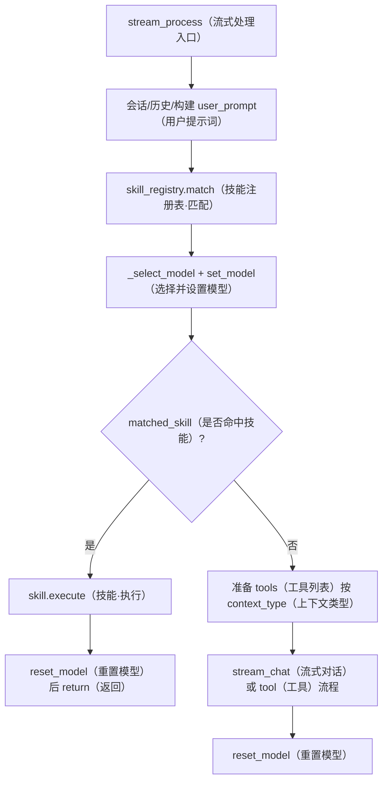
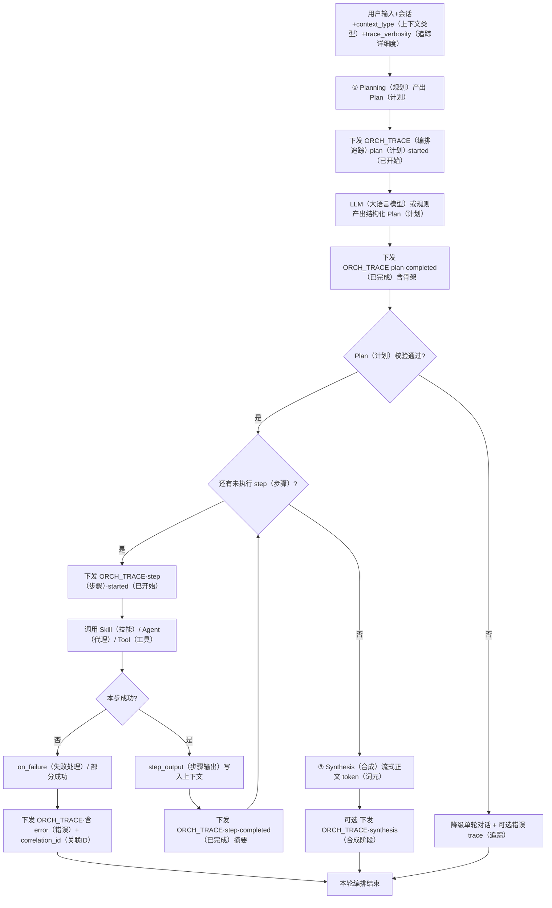
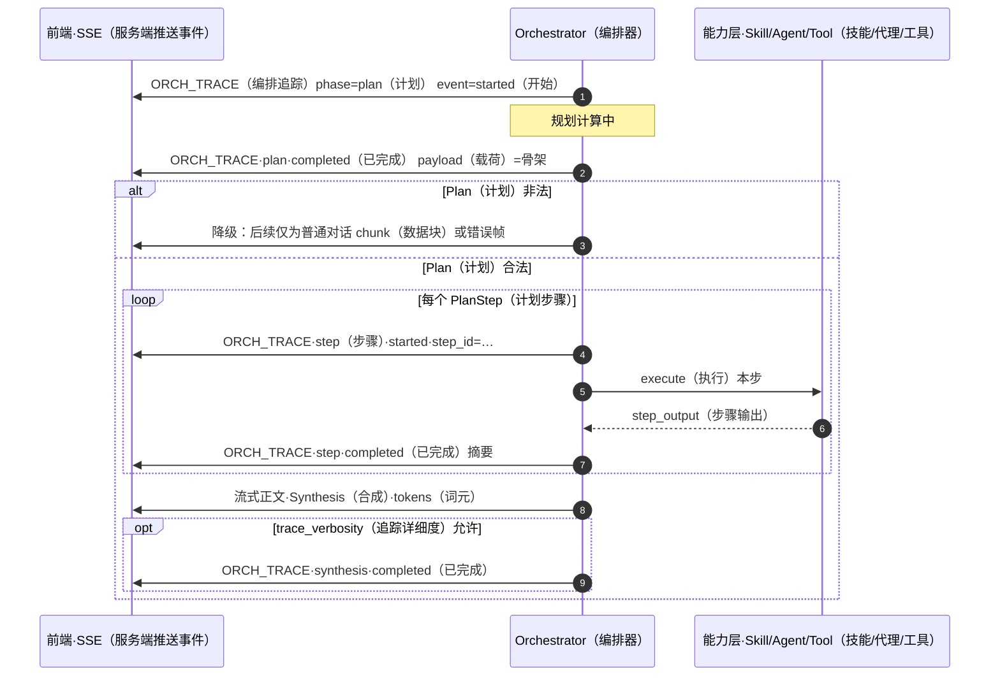

# 编排层重构方案：从「技能命中」到「意图驱动的任务编排」

**文档类型**：01X 系统组件 / 编排与路由  
**状态**：方案（待评审与分期实施）  
**时间**：2026-03-22；**2026-03-22 增补**：执行层/Plan/多模型/可观测性；**2026-03-22 增补②**：编排 trace；**2026-03-24**：§2.1.1 / §1.4 **Mermaid**；**2026-03-24 增补**：§2.1.2 **ORCH_TRACE 之后发生什么**（时序澄清）  
**关联文档**：[01-multi-agent-design.md](./01-multi-agent-design.md)（协调器与多 Agent 理想形态）、[model-selectable-at-use-time-design.md](./model-selectable-at-use-time-design.md)  

---

## 1. 背景与问题陈述

### 1.1 名义职责 vs 实际行为

`UnifiedOrchestrator` 在文档中被描述为负责分析任务、选择组件、协调执行；但当前主路径上，**「编排」大量退化为**：

1. `SkillRegistry.match(user_input)`：**先**用独立 `LLMService()` 做一次「从技能列表里选一个名字」的分类；**失败或解析异常**则落入数百行 **关键词 + 人工打分** 的回退逻辑（`backend/core/agent/skills/registry.py`）。
2. 命中后 **单技能执行即返回**，无多步计划、无显式子 Agent 组合、无任务图。
3. 未命中再走「带/不带工具的流式对话」，与前面的「技能抢答」**两套决策机制并存**。

### 1.2 主要缺陷（工程与产品）

| 维度 | 问题 |
|------|------|
| **语义** | 「编排」名实不符；用户期望的是 **按意图组织多能力完成任务**，不是 **抢答一个 Skill**。 |
| **可靠性** | 关键词与写作类意图（如「总结」）重叠，易 **误匹配**；回退路径不可测试、难审计。 |
| **一致性** | 匹配用 **独立 LLM 实例**，与用户所选模型、Orchestrator 共用 `llm_service` 可能不一致。 |
| **可维护性** | 每增技能易加剧关键词森林；与 [01-multi-agent-design.md](./01-multi-agent-design.md) 中的 Coordinator / 任务分解 **脱节**。 |

### 1.3 重构目标（必须满足）

1. **意图显式化**：将「用户要什么」固化为 **结构化中间表示**（Intent / TaskSpec / Plan），可日志、可单测、可回放。  
2. **编排可组合**：支持 **多步**（顺序为主，预留并行）；一步对应 **一种能力调用**（Agent 调用 / 已注册 Skill / Tool）。  
3. **决策单通道**：同一请求路径上，**避免**「LLM 分类 + 关键词回退」双轨；明确 **唯一权威** 的决策入口或可解释的优先级规则。  
4. **按场景裁剪**：`general_chat` / `article_writing` / `work_assistant` 等 **context_type** 使用不同 **能力白名单与策略**，禁止用全局同一套关键词抢答覆盖所有场景。  
5. **可渐进迁移**：分阶段落地，线上可开关（feature flag），旧逻辑可阶段性保留但 **默认关闭** 或仅限兼容期。  
6. **对用户可解释**：编排决策与执行过程 **结构化输出到前端**（在用户开启的详细程度下），而非仅「输入 → 黑箱 → 输出」；与运维日志分离，见 **§2.4**。

### 1.4 现状主路径流程图（`stream_process` 简化）

以下反映 **写作助手等已统一「match 后先选模」** 后的顺序；技能抢答仍依赖 `SkillRegistry.match`（待按分期替换为意图/Plan）。



---

## 2. 目标架构总览

### 2.1 三层模型（含对用户可见的痕迹）

```
用户输入 + 会话上下文 + context_type  +  trace_verbosity（可选）
        ↓
┌────────────────────────────────────────────┐
│ ① Intent / Planning（编排决策）              │
│   输出：结构化 Plan + 对用户可见的决策摘要     │ → 流式 Trace（意图要点、选能力理由、Plan 骨架）
└────────────────────────────────────────────┘
        ↓
┌────────────────────────────────────────────┐
│ ② Execution（执行器 / Coordinator）        │
│   按 Plan 逐步调用 + 每步状态/进度/摘要结果   │ → 流式 Trace（step 开始/结束/耗时/可展示摘要）
└────────────────────────────────────────────┘
        ↓
┌────────────────────────────────────────────┐
│ ③ Observation & Synthesis（可选）           │
│   聚合多步结果 → 流式正文回复用户             │ → 可选：执行总结一条 Trace
└────────────────────────────────────────────┘
```

**原则**：① 只负责「决定做什么」；② 只负责「怎么做、按序执行」；③ 负责「怎么说给用户听」（可与主模型合并）。**对用户透明** 不等价于把原始模型 CoT 全文外泄：对外发送的是 **结构化 rationale + 步骤状态**，敏感字段过滤见 §2.4.4。

### 2.1.1 目标架构流程图（意图驱动 + 用户向 Trace）

**易误解点**：`ORCH_TRACE`（**编排追踪帧**，Orchestration Trace）**不是**流程终点；每条 trace 只是 **在主线推进过程中经 SSE（服务端推送事件）多推一帧 JSON（数据格式）**。  
- **plan（计划）类 trace 结束后**：服务端继续 **校验 Plan（计划）** → 进入 **Execution（执行）**（或降级）。  
- **单步 step（步骤）类 trace（如 `step_completed`）结束后**：若有下一步 → **再执行下一 `PlanStep（计划步骤）`**；若无 → 进入 **Synthesis（合成/汇总输出）**；若本步失败 → 走 **on_failure（失败策略）**，仍可能再发错误类 trace 再结束或降级。



**与方案 A（Tool-first）的对应**：若未生成显式 `Plan`，可将「多轮 tool 调用」视为 **隐式步骤**：每次 tool 前/后仍发 **`step_*` 级 ORCH_TRACE**，最后 **`stream_chat` 出正文** 等价于上图中 **Synthesis**（§2.4.5）。

### 2.1.2 ORCH_TRACE 与主线的时序（泳道）

下图强调：**trace 与业务逻辑穿插**；前端先收到 trace 帧，**不表示**请求已结束。



**时间：2026-03-24；理由：避免把 ORCH_TRACE 画成与主线并列的「死胡同」；方法：在 §2.1.1 用细粒度节点表达「emit 后继续」；§2.1.2 用序列图固定先后。**

### 2.2 核心数据结构（建议）

以下为逻辑模型，实现可用 Pydantic / TypedDict。

```text
IntentSummary:
  goal: str                    # 用户目标一句话
  context_type: str            # 与现有会话类型对齐
  constraints: dict            # 可选：长度、语言、禁止工具等

PlanStep:
  step_id: str
  capability_id: str           # 如 "skill:writing_profile_summary" | "agent:article_writing" | "tool:web_search"
  inputs_ref: str              # 引用上下文键或上一步输出 id
  on_failure: "abort" | "fallback_chat" | "retry"

Plan:
  steps: List[PlanStep]
  version: str                    # Plan schema 版本，用于迁移与灰度
  plan_id: str                     # 可选：用于日志与分布式追踪
```

**capability_id 注册表**：与现有 `Skill`、`Agent`、Tool 名称 **显式映射**，禁止字符串魔法散落；注册项建议含 **`semantic_version`**（能力契约版本）、**`required_context_keys`**（依赖的上下文键），见 §10.3。

### 2.3 Plan 结构扩展（v2，与分期对齐）

初版 §2.2 刻意保持最小可实施；**阶段 3 及以后**引入下列字段，避免「静态 Plan 无法表达依赖与并行」：

```text
RetryPolicy:
  max_attempts: int
  backoff_ms: int                # 简单指数退避上限由配置封顶

PlanStep（扩展字段，与 §2.2 合并）:
  depends_on: List[str]          # 前置 step_id；无环有向图，拓扑序执行
  parallel_group: Optional[str]  # 同组且 depends_on 均已满足时可并行（组内仍可有顺序）
  timeout_ms: Optional[int]       # 单步超时；默认取自 capability 注册表全局默认
  retry: Optional[RetryPolicy]    # 细于 on_failure 的「可重试错误」策略
  idempotent: bool                # 是否允许安全重试（与补偿策略相关）
  rationale: Optional[str]       # 为何选此能力/此顺序（对用户展示用短文案，可由 Planner 或规则生成）
  confidence: Optional[float]     # 0~1，低置信度时可触发澄清或仅 summary 级展示
```

**顺序与并行**：默认 **全序**；仅当 `parallel_group` 与 `depends_on` 同时满足安全条件时并行（例如两个只读检索）；**写后读**必须显式依赖。

### 2.4 透明度与可解释性：思考过程输出到前端

评审指出：仅 **§10.1 运维向日志** 不足以满足 **用户信任与排错**；须将 **编排决策依据与执行进度** 以 **实时、结构化** 方式送达 UI（与「最终正文」并列）。

#### 2.4.1 用户可见内容（建议分层）

| 层级 `trace_verbosity` | 用户看到什么 |
|------------------------|----------------|
| `off` | 仅最终回复（与今日行为一致，默认可保留） |
| `summary` | 意图一句话、Plan 步骤标题列表、当前 step 名称、成功/失败摘要 |
| `full` | 在 summary 基础上增加每步 **rationale**、依赖说明、重试/降级触发条件（仍非原始模型全文思维链） |

**请求侧**：`context["orchestration_trace"]` 或查询参数 `trace=summary|full`，由产品与隐私策略默认。

#### 2.4.2 流式协议（对齐现有 SSE 实现）

当前主路径已使用 `StreamMessageBuilder`（`backend/api/stream_sender.py`）输出 `__DEBUG__:`、`__STATUS__:`、`__TOOL__:` 等。**编排痕迹** 应与 **开发调试用 `__DEBUG__`** 区分，避免用户界面误把内部日志当产品文案。

**推荐（二选一，实施时定案）**：

1. **新前缀** `__ORCH_TRACE__:{json}\n`，`json` 含统一信封：  
   `{"v":1,"plan_id","phase":"intent|plan|step|synthesis","event":"started|delta|completed|failed","payload":{...}}`  
2. 或 **`__DEBUG__` 内** 增加 **`audience":"user"|"developer"`** 与 **`kind":"orchestration"`**，前端只渲染 `audience=user`。

**WebSocket**：若未来会话走 WS，同一 JSON 信封可复用；**不要求**为编排单独先做双向 WS，**HTTP SSE 与现有 chat stream 一致即可**。

#### 2.4.3 各阶段 payload 要点

- **intent**：解析后的 `goal`、`context_type` 命中说明（非敏感规则摘要）。  
- **plan**：`steps[].step_id`、`capability_id` 的 **人读标签**、`depends_on` 拓扑简述、`rationale`（来自 §2.3）。  
- **step**：`step_id`、状态、`progress` 0–100、**中间结果摘要**（截断、脱敏）、错误码与用户可读说明。  
- **synthesis**：多步聚合的一句话总结（可选）。

#### 2.4.4 隐私、安全与性能

- **禁止**将 API Key、cookie、完整用户粘贴长文、他人 PII 打入 trace；**中间结果**默认 **长度上限 + 脱敏规则**。  
- **序列化开销**：summary 级仅发小 JSON；full 级对 payload 做 **节流**（如每步最多 N 条 delta/秒）。  
- **存储与回放**：trace **默认不落库**；若产品需要「会话内回看」，可将 **同请求 trace 摘要** 写入 assistant 消息 `metadata.orchestration_trace_summary`（可选，须合规评审）。

#### 2.4.5 与方案 A（Tool-first）的关系

- 每次 **tool 调用** 对应一条 **step 级 trace**（工具名、参数摘要、结果摘要）；模型若支持 **流式 reasoning**，**不得**默认等同编排 trace，仍按 §2.4.4 过滤后择优下发。

---

## 3. 编排决策的三种实现路径（必选其一为主，可组合）

### 方案 A：主对话模型 + Function Calling / Tools（推荐为长期默认）

- **做法**：在允许使用工具的场景中，将「可执行能力」暴露为 **tools**（或 OpenAI-compatible functions），由 **当前对话模型** 在 **同一条 system/user 上下文** 下决定是否调用、调用哪一个、参数是什么。多步则 **多轮 tool 循环** 直至模型给出最终答复。  
- **优点**：决策与上下文一致；无单独「抢答 LLM」；用户所选模型即决策模型（已与 `llm_service` 对齐）。  
- **缺点**：依赖模型 tool 能力；需控制工具数量与描述质量。  
- **适用**：`general_chat`、未来统一的「能力型」助手。

### 方案 B：专用 Planner 模型（小模型 / 固定模型）

- **做法**：独立一步 `plan(task, context) -> Plan`，再用执行器执行；Planner 可用便宜模型、固定 `reasoning` 线路。  
- **优点**：与主对话解耦；便于 A/B 和审计。  
- **缺点**：仍要解决 Planner 与主模 **意图漂移**；需严格 schema 与校验。  
- **适用**：复杂任务、成本高时的「先规划后执行」。

### 方案 C：混合策略（按 context_type 分支）

| context_type | 策略 |
|--------------|------|
| `article_writing` | **默认不跑全局 SkillRegistry.match**；主路径为 **纯对话 + 可选 UI 触发的显式能力**（见 §5）；或仅允许 **窄白名单 tools**（如 `apply_writing_profile_summary` 仅由按钮触发）。 |
| `work_assistant` | 同写作助手：**意图由对话 + 显式动作** 驱动，避免关键词抢答。 |
| `general_chat` | **方案 A** 为主；逐步 **下线** registry 关键词回退。 |

---

## 4. 执行层：与现有 Coordinator / Skill 的衔接

### 4.1 执行器职责

- 输入：`Plan` + `session_id` + `context`。  
- 按 `PlanStep` 顺序调用：  
  - **Skill**：保留现有 `Skill.execute(parameters, context)`，但 **不再由 registry.match 唯一入口**；由 Plan 指定 `skill_name` 与参数来源。  
  - **Agent**：如 `ArticleWritingAgent.execute(...)`，由 Plan 引用。  
  - **Tool**：走现有 `ToolRegistry`。  
- 错误策略：按 `on_failure`；**时间：2026-03-22；理由：避免静默吞错；方法：统一记录 step 级审计日志 + 用户可见错误边界。**

### 4.2 与 `01-multi-agent-design.md` 的对齐

- 将现有 `Coordinator` 的 **顺序 / 并行** 模式与 `Plan` 映射；若当前 Coordinator 未接流式，**分期**：先支持顺序 + 单步 Skill，再扩展并行。  
- **禁止**再新增「在 `SkillRegistry.match` 里加关键词分支」作为长期方案；新增能力应进入 **capability 注册表 + Plan**。

### 4.3 异步执行抽象

- **要求**：执行器 API 以 **`async` 为一等公民**（`await` 每步 Skill/Agent/Tool）；禁止在编排主路径阻塞线程池伪装同步。  
- **流式**：每步可向 `progress_callback` / SSE 上报 **step 开始、结束、耗时**；与现有 `StreamMessageBuilder` 调试事件对齐。  
- **分期**：阶段 1～2 仍以 **单步或短序列** 为主，但接口设计须预留异步串联。

### 4.4 执行状态：持久化与恢复（分期边界）

| 阶段 | 状态持久化 | 说明 |
|------|------------|------|
| 1～2 | **内存态即可** | Plan 若存在，仅当次请求内有效；失败不跨请求恢复。 |
| 3+ | **可选 checkpoint** | 将 `plan_id`、已完成 `step_id`、每步输出摘要写入会话 metadata 或独立表；**仅当**产品需要「长任务断点续跑」时启用。 |

**原则**：无明确产品指令前 **不做**分布式事务式持久化，避免过度工程（与用户规则「无明确指令不兜底」一致）；文档仅规定 **扩展点**。

### 4.5 失败、部分成功与补偿（Saga）

- **部分成功**：执行器维护 **`completed_steps: List[StepResult]`**；某步失败时，根据 Plan 级策略 **`on_partial_failure`**：`abort`（默认）| `report_partial`（向用户展示已完成摘要 + 失败步）| `compensate`（仅对 `idempotent=true` 且注册了 `compensate_capability_id` 的步骤尝试逆操作）。  
- **数据一致性**：跨步 **共享可变状态**（如写库）的能力必须在注册表中标记 **`side_effects: write`**；此类步骤失败时 **不自动静默回滚**，由产品决定是人工介入还是补偿脚本。  
- **用户可见错误**：统一经 **`user_facing_error` 或等价层** 映射，避免将原始堆栈直出；复杂场景返回 **结构化错误码**（`step_id` + `code` + `message`）。

### 4.6 多模型：Planner 与 Executor 的一致性

| 场景 | 模型策略 | 说明 |
|------|----------|------|
| 方案 A（Tool-first） | **单模型** | 决策与执行均为当前用户所选 `llm_service`，无 Planner/Executor 分裂。 |
| 方案 B（独立 Planner） | **双模型显式配置** | 环境变量或配置项：`PLANNER_MODEL` / `PLANNER_PROVIDER`；执行步默认 **回退用户模型**，若某 capability 注册 **`preferred_model`** 则仅该步覆盖。 |
| 混用 | **审计必填** | 日志与 SSE 中记录 **每步所用 model_id**，便于排查「规划用 A、执行用 B」导致的行为差异。 |

**意图漂移缓解**：Planner 输出必须经过 **schema 校验 + 能力白名单过滤**；非法字段整 Plan 拒绝并 **降级为单轮对话**（显式降级，不静默）。

---

## 5. 写作 / 工作助手：专项策略（高优先级产品决策）

### 5.1 问题根因

写作类关键词（含「总结」「整理」等）与 **画像总结技能**、**摘要类** 等在关键词层 **不可分**，是体验问题的核心来源。

### 5.2 推荐策略

1. **默认**：`article_writing` 进入 Orchestrator 后 **跳过** `SkillRegistry.match`（或仅允许 **显式元数据** 指定技能，如 `context["forced_capability"]`，由前端按钮写入）。  
2. **「总结画像」**：改为 **设置页 / 写作侧栏按钮** 调用 **独立 API** 或带 `forced_capability=writing_profile_summary` 的 chat，**不依赖**自然语言抢答。  
3. **兜底**：若必须保留一句话触发，**仅**在方案 A 下作为 **单个 tool** 由模型调用，且 **description 极窄**，不再用全局关键词表。

**时间：2026-03-22；理由：产品意图明确优于 NLP 猜测；方法：显式事件 > 隐式 match。**

---

## 6. 废除与迁移计划（分期）

### 阶段 0：约束与观测（1 周内可完成）

- 为 `SkillRegistry.match` 增加 **结构化日志**：是否走 LLM 分支、是否回退关键词、最终 skill、context_type。  
- 指标：误匹配率（人工抽样）、各 context_type 分布。  
- **（增补）编排 trace 协议草案**：在 `stream_sender` 层增加 `build_orchestration_trace`（或约定 `__ORCH_TRACE__` 字段集）；前端约定 **仅渲染 `audience=user`**；默认 `trace_verbosity=off` 不改变现有 UX。
- **实现状态（2026-03-13）**：`SkillRegistry.match` 在 INFO 级别输出 `SKILL_MATCH_TRACE` + JSON 单行（见上）；单测：`test_skill_registry_match_trace.py`。  
- **实现状态（2026-03-13 续）**：`StreamMessageBuilder.build_orchestration_trace`、`resolve_orchestration_trace_verbosity`（`backend/api/stream_sender.py`）；主 `stream_process` 在 `context["orchestration_trace"]` / `trace_verbosity` 或环境变量 `ORCH_TRACE_VERBOSITY` 为 `summary`/`full` 时下发 `__ORCH_TRACE__`（`intent`·started → `step`·skill_prematch/model_select → `synthesis`·started）；默认 `off`。单测：`backend/api/tests/test_orchestration_trace.py`、`backend/core/agent/tests/test_stream_process_orch_trace.py`。前端/React 与 `stream_handler` / `message_handler` 已过滤，避免 trace 进入正文气泡。**待办**：按产品做「用户可见」面板、仅渲染 `audience=user` 的富展示；技能执行路径内 step 级 trace。

### 阶段 1：按场景关闭抢答（2～3 周）

- `article_writing` / `work_assistant`：**stream_process** 中 **跳过** `skill_registry.match`（feature flag：`DISABLE_SKILL_PREMATCH_FOR_ASSISTANTS=true`）。  
- 验证：写作助手 E2E、画像总结按钮路径。
- **实现状态（2026-03-13）**：已落地 `UnifiedOrchestrator._disable_skill_prematch_for_assistants`；**实际生效**的流式入口为下方第二个 `stream_process`：在 `_stream_intelligent_orchestration` 内跳过 `skill_registry.match`；非流式为 `process` → `process_dynamic` 在同样 flag 下跳过 `skill_registry.match`。已删除曾被覆盖的无用旧版 `process` / `stream_process` 定义以免误改；`env.example` 已登记；单测见 `test_orchestrator_skill_prematch_flag.py`。

### 阶段 2：general_chat 改为 Tool-first（4～8 周）

- 将高价值 Skill 逐步 **封装为 tools**；Orchestrator **不再**在流式前调用 `match`。  
- 关键词回退：**默认关闭**；仅 `ENABLE_LEGACY_SKILL_KEYWORD_MATCH=true` 时开启（兼容期）。

### 阶段 3：统一 Plan + Coordinator（中长期）

- 引入 `Plan` 与 `PlanExecutor`；复杂任务走 **方案 B** 可选。  
- 删除 `registry.py` 中关键词打分大块代码（需先确认无环境依赖该路径）。

---

## 7. 风险与对策

| 风险 | 对策 |
|------|------|
| 模型不调用 tool | 收紧 tool 描述 + few-shot；必要时 **方案 B** 兜底一步规划。 |
| 延迟增加 | 多步串行可合并为「单步复合 Skill」过渡；Planner 用小模型。 |
| 回归面大 | feature flag + 分 context_type 发布；保留旧路径开关至兼容期结束。 |
| Plan 语义不可靠 | schema 校验 + 白名单 capability；黄金用例集 **快照测试**（见 §8.2）。 |
| 运维定位难 | **plan_id / step_id** 贯穿日志与 SSE；见 §10.1。 |
| 配置爆炸 | `context_type` 级默认 + 少量全局默认；复杂调参进 **可选** 配置文件并文档化。 |
| Trace 泄露敏感信息 | §2.4.4 脱敏与长度上限；默认 off；full 需显式开启。 |
| 流量与渲染压力 | summary 默认；full 节流；大 payload 只进日志不进用户流。 |

### 7.1 写作助手「智能性」担忧与设计对齐（2026-03-13）

对「意图驱动重构后，写作助手是否仍不够懂意图、上下文是否仍会乱」类担忧，与本文档及代码现状对齐如下（可与产品/评审共用）。

| 担忧 | 是否合理 | 说明与对策 |
|------|----------|------------|
| **意图理解有上限** | 是 | 自然语言歧义与表达多样性无法被任何单次 prompt 消除；重构提供的是 **显式 Intent/Plan + 可观测步骤**，降低「黑箱猜错」概率，**不**保证百分百懂。 |
| **上下文紊乱** | 部分场景是 | 长对话、多话题交织时，任何架构都可能出错；Plan 化后应用 **步骤级输入输出契约**、**correlation_id / trace**（§10、阶段 0 `SKILL_MATCH_TRACE`、待办 `__ORCH_TRACE__`）便于发现与归因。 |
| **固定模板 = 不够智能** | 需区分入口 | 代码中 **`ArticleWritingAgent` 继承 `BlogWritingAgent`**（`article_writing_agent.py`），用于 **Agent/工具链** 类能力；**写作会话主路径**在现行实现里多为 Orchestrator 内 **`get_article_writing_system_prompt` + 参考块** 的流式对话（不参考历史、默认不调工具）。两者并存，讨论「写作助手智能性」时应 **指明是哪条入口**。 |
| **仅靠用户说清楚** | 是 | 产品层可增 **多轮澄清 / 意图确认**（本文档不强制实现，属阶段 3+ 或独立 PRD）；编排层先完成 **关抢答、tool-first、trace**。 |
| **重构后 Plan 仍可能蠢** | 是 | 对策见上表「Plan 语义不可靠」与 §8.1 黄金用例；需 **持续监控 + 人工抽样**，而非一次上线即止。 |

**结论（与外部讨论稿一致处）**：担忧成立；意图驱动与可观测执行 **改善可控性与可调试性**，**不**等价于「完全理解用户」。实施上应优先 **trace / 日志 / 契约测试**，再迭代澄清与 Plan 质量。

---

## 8. 测试与验收

1. **单元**：Plan 解析、capability 映射、执行器单步失败分支。  
2. **契约**：各 `context_type` 下「是否允许 prematch」的矩阵测试。  
3. **集成**：写作页「仅对话」与「按钮触发画像总结」互不串线。  
4. **人工**：典型误匹配句子集（历史 bug）回归为 **0 抢答错误**（在关闭关键词后）。

### 8.1 Plan 正确性与语义验证

- **契约测试**：对 Planner（若启用）输入 **固定 user + context**，期望输出 **JSON Schema 合法** 且 `capability_id` ∈ 白名单。  
- **黄金用例**：维护 `tests/fixtures/planner_golden/*.json`（脱敏），CI 对比 **结构与子集字段**（避免 LLM 全文逐字断言）。  
- **端到端**：复杂 Plan 以 **少而精** 场景覆盖（≤10 条），侧重 **顺序依赖 + 一步失败**。

### 8.2 性能基准（实施阶段再填数）

- **指标**：`T_plan`（若存在独立规划）、`T_step_p50/p95`、端到首 token、总耗时；与 **当前实现**（prematch + 单技能）同场景对比。  
- **门槛**：阶段 2 上线前在预发跑 **基线报告**，回归 **p95 不超过基线 +X%**（X 由团队拍板，建议初始 30% 或按产品容忍度调整）。  
- **延迟累积**：多步默认 **串行**；并行仅用于只读步骤，且上限 **并行度 N** 配置封顶。  
- **Trace 开销**：对比 `trace=off` vs `summary` 的 **额外字节数 p95** 与 **首包时间**，确保 summary 不显著拖慢首 token。

### 8.3 前端与协议验收

- **解析**：前端能区分正文 chunk / `__ORCH_TRACE__`（或带 `audience` 的 debug），错误解析不破坏主文渲染。  
- **展示**：summary 级展示 Plan 步骤列表 + 当前 step；失败时展示 **用户可读错误 + correlation_id**。  
- **回放**（若启用 metadata 摘要）：历史会话仅显示摘要，与实时 full trace 区分。

---

## 9. 结论

当前「编排」的核心问题不是「有没有 LLM」，而是 **决策机制与产品形态**：**单技能抢答 + 关键词森林** 无法承担「按意图组织多 Agent / 多能力」的职责。  

重构方向应为：**结构化意图与计划 + 显式执行器 + 按场景裁剪决策入口**；写作 / 工作助手 **优先用显式动作与 tool 调用** 替代全局 `SkillRegistry.match`。

**可解释性** 与上述同等重要：**编排决策与执行进度** 须能通过 **统一流式协议** 在用户选择的详细程度下展示（§2.4），与内部调试日志分离，避免黑箱体验。

本方案与 [01-multi-agent-design.md](./01-multi-agent-design.md) 中的 Orchestrator / Coordinator 分工 **一致**，是对现有实现的技术债偿还路径，而非另起一套平行概念。

---

## 10. 评审补强：可观测性、兼容、扩展与产品体验

### 10.1 可观测性与诊断（运维 vs 用户）

- **结构化日志（运维，全量）**：`plan_id`、`context_type`、`step_id`、`capability_id`、`duration_ms`、`model_id`、`outcome`、原始异常栈。  
- **用户向编排 trace（产品）**：见 **§2.4**，使用 **`__ORCH_TRACE__` 或 `audience=user` 的调试子类型**；与仅开发者可见的 `__DEBUG__` 区分。  
- **开发调试**：现有 `__DEBUG__` 保留；可选在 debug 中复用 `plan` / `step` 字段名，但 **不得**依赖用户界面展示。  
- **故障定位**：错误响应带 **`correlation_id`**（同 `plan_id` 或独立 UUID），用户反馈时可检索全链。

### 10.2 向后兼容与会话历史

- **会话消息存储**：现有 `Message` 模型 **无需**为旧会话迁移 Plan 结构；Plan 仅作为 **当次请求的瞬时或可选 checkpoint 元数据**。  
- **渐进迁移**：旧客户端不传 `forced_capability` 时行为由 **feature flag** 决定；兼容期内保持可回滚。  
- **历史回放**：不强制「重放 Plan」；审计以 **已落库消息与工具调用记录** 为准。

### 10.3 capability 注册：依赖、版本与原子性

- **依赖**：注册表可声明 **`requires_capabilities`**（软依赖，用于文档与静态检查）或 **`hard_requires`**（执行前校验上下文，不满足则拒执行）。  
- **版本**：`capability_id@version` 与实现代码 **同步 bump**；破坏性变更走 **灰度**（按用户/会话比例或 `context_type`）。  
- **原子性**：单次请求内注册表 **只读快照**；运行中 **禁止**热更注册表影响当次 Plan（避免半套新旧定义）。

### 10.4 扩展性与动态意图

- **静态 Plan 局限**：对「用户中途改目标」类场景，采用 **短 Plan + 每步结束 re-plan**（小循环）或 **方案 A** 由模型直接决定下一 tool，而非单次生成巨型 Plan。  
- **新增能力类型**：执行器采用 **策略表**（visitor/registry）注册 `handler(capability_kind)`，避免每加一种改一处巨型 `if`。

### 10.5 产品体验与降级

- **即时感**：首包尽量 **快速 token**（可先流式输出「正在执行某步…」再出结果）；长步骤必须 **进度条或状态 SSE**。  
- **Plan 生成失败**：**显式降级** → 单轮对话 + 可选提示「未生成结构化计划，已按普通对话处理」；**不**静默丢意图。  
- **模糊意图**：Planner 置信度低时（若实现置信字段）→ **澄清问题** 一轮，而非强行执行高风险的写操作。

### 10.6 前端组件与交互（需求级）

- **编排时间线**：按 `phase`/`event` 展示意图 → Plan 骨架 → 逐步执行 → 合成（与 §2.4.2 信封一致）。  
- **Plan 简图**：步骤节点 + 依赖箭头（仅 full 或调试模式）。  
- **进行中干预**（可选、后期）：用户取消后续 step、或强制改走「仅对话」——须 **单独设计** 与会话状态机，不在本文展开。  
- **错误诊断区**：失败 step 的用户文案 + **重试**（若 `on_failure` 允许）+ correlation 复制。

---

## 11. 附录：现状代码锚点（便于改代码时对照）

| 组件 | 路径 |
|------|------|
| 流式主流程 | `backend/core/agent/orchestrator.py` → `stream_process` |
| SSE 消息构建 | `backend/api/stream_sender.py` → `StreamMessageBuilder` |
| 技能抢答 | `backend/core/agent/skills/registry.py` → `match` |
| 技能白名单（写作） | `backend/core/agent/agent_tools_registry.py` → `AGENT_SKILLS` |
| 上下文类型 | 请求 `context_type` + session `metadata.type` |

---

## 12. 附录：评审问题对照表（速查）

| 评审项 | 文档落点 |
|--------|----------|
| 异步执行 | §4.3 |
| 回滚/补偿、部分成功 | §4.5 |
| 状态持久化与恢复 | §4.4（分期，无过度兜底） |
| Plan 并行/依赖/超时/重试 | §2.3 |
| Planner vs 执行模型 | §4.6 |
| Plan 语义验证、E2E 难度 | §8.1 |
| 性能基准与延迟累积 | §8.2 |
| 会话兼容、迁移 | §10.2 |
| 配置与 context 差异 | §7、§10.5、方案 C |
| capability 依赖与版本 | §10.3 |
| 可观测、运维 | §10.1 |
| 用户感知与降级 | §10.5 |
| 思考过程对用户可见、trace 分层 | §2.4、§1.3 目标 6 |
| 流式协议扩展（ORCH_TRACE / audience） | §2.4.2、§8.3 |
| 前端时间线 / Plan 简图 | §10.6 |
| Trace 隐私与性能 | §2.4.4、§7、§8.2 |
| Mermaid 流程图 | §1.4、§2.1.1、§2.1.2 |
| ORCH_TRACE 后行为 | §2.1.1 文内要点、§2.1.2 序列图 |
